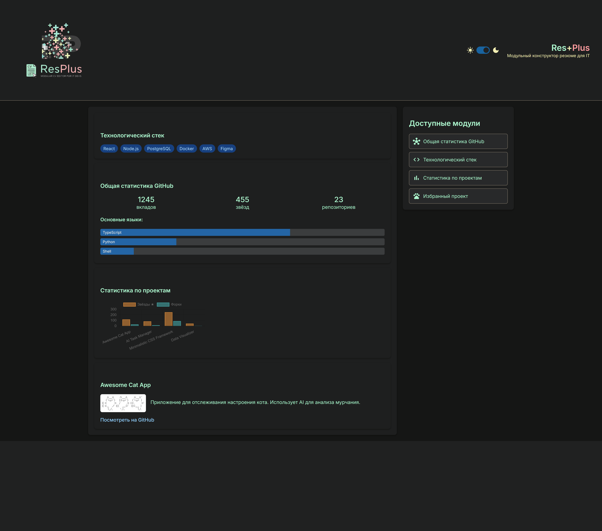
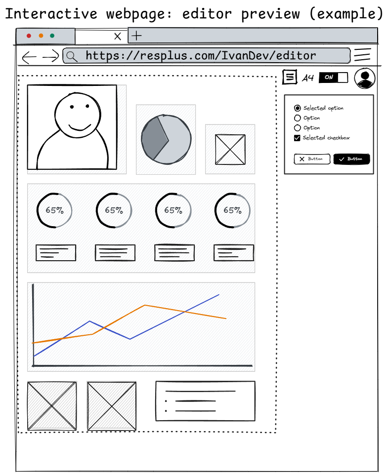
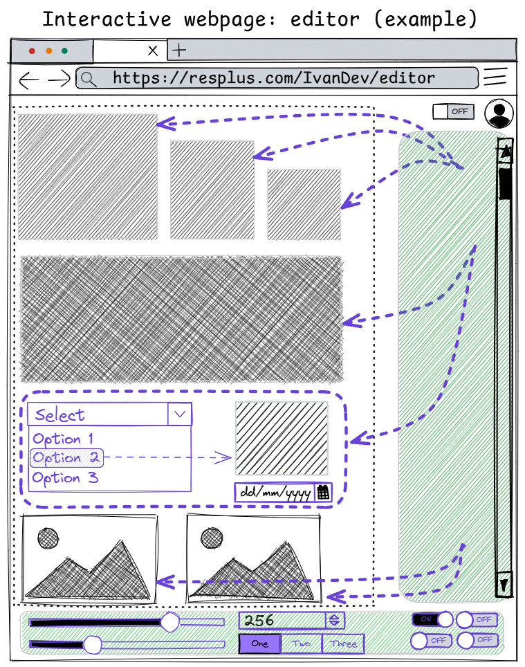
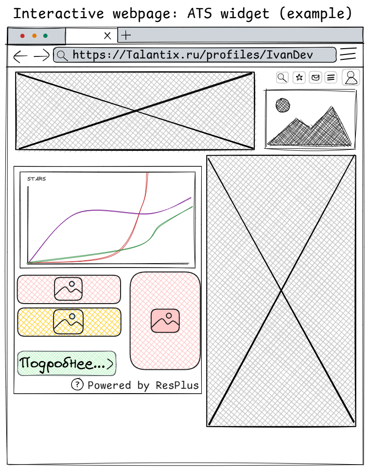
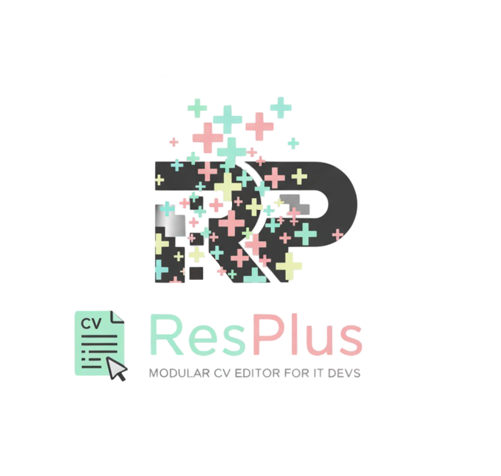

# Hi! Here is the home of ResPlus project!

Here i learnt some bout static webpages and it's hosting with js usage for drag-n-drop + basic data insights creation, all for implementin required business logic.

# Making of

# Logo

